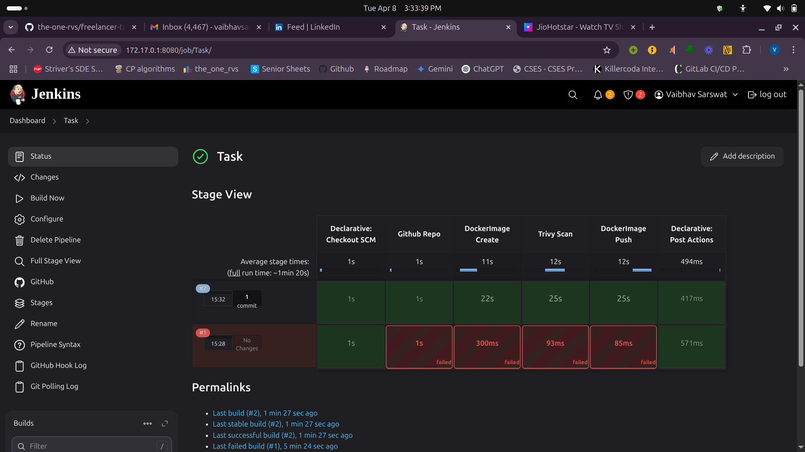

# Express Application with CI/CD Pipeline

A simple Express.js application with Jenkins CI/CD pipeline integration and Docker containerization.



## Project Structure

```
.
├── Jenkinsfile          # Jenkins pipeline configuration
├── app/
│   ├── Dockerfile      # Docker configuration for the app
│   ├── package.json    # Node.js dependencies and scripts
│   └── src/
│       └── index.js    # Main application file
└── images/
    └── image.png
```

## Features

- Express.js web server
- Docker containerization
- Automated CI/CD pipeline with Jenkins
- Container security scanning with Trivy
- Automated Docker image publishing

## Prerequisites

- Node.js
- Docker
- Jenkins
- Trivy scanner

## Local Development

1. Navigate to the app directory:
```bash
cd app
```

2. Install dependencies:
```bash
npm install
```

3. Start the development server:
```bash
npm start
```

The server will be running at http://localhost:3000

## Available Endpoints

- `GET /`: Returns "Hello World"
- `GET /go`: Returns "Let's go"

## Docker

Build the Docker image locally:
```bash
docker build -t myapp ./app
```

Run the container:
```bash
docker run -p 3000:3000 myapp
```

## CI/CD Pipeline

The Jenkins pipeline includes the following stages:

1. **Github Repo**: Pulls the latest code from the repository
2. **DockerImage Create**: Builds the Docker image
3. **Trivy Scan**: Performs security scanning of the Docker image
4. **DockerImage Push**: Pushes the image to DockerHub

The pipeline is triggered by:
- GitHub push events
- SCM polling (every minute)

## Environment Variables

The application uses the following environment variables:
- `PORT`: Server port (defaults to 3000)

## License

ISC